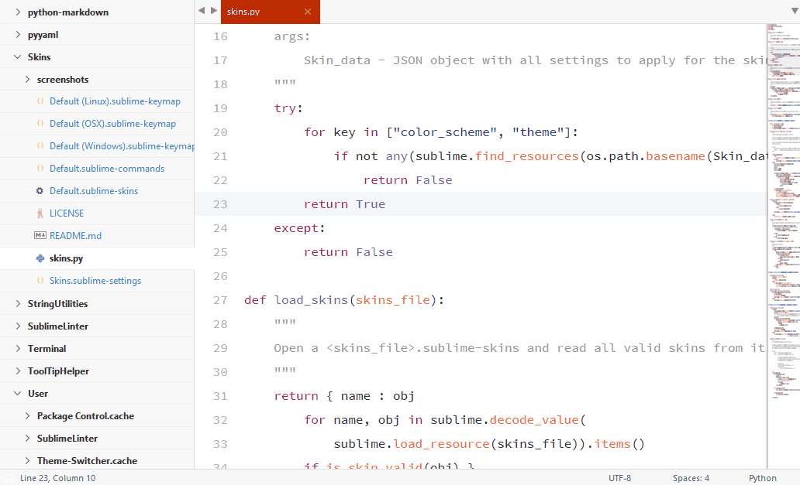

# [Skins][home]
[](http://opensource.org/licenses/MIT)

With **Skins** users can change the theme and color scheme of **Sublime Text** together with only one command. A skin is nothing else but a collection of settings appied to Sublime Text, if a skin is selected. Skins can be provided in theme packages such as _Boxy Theme_ or they can be created by users themeselfs by saving the current settings as a _User Skin_ of any name.



## End Users
### General Usage
Open the `command pannel` with <kbd>Ctrl+Shift+P</kbd> and type `Select Skin`, `Save User Skin` or `Delete User Skin`.


### Settings
By default only `color_scheme`, `theme`, `font_face` and `font_size` are stored by `Save User Skin`. If you want more settings to be stored, you can change the `skin-template` in the `Skins.sublime-settings`.

**Example**

```javascript
"skin-template":
{
	"Preferences": ["color_scheme","theme","font_face","font_size" /* ... */ ],
	"SublimeLinter": {
		/* structured settings are supported, too */
		"user": ["error_color","gutter_theme","warning_color"]
	}
	/* add more packages here */
}
```

## Theme Developers
### General
`Skins` parses all `<AnyName>.skins` files in all packages. They are expected to store a collection of settings for sublime text and other packages. More than one skins file can exist in a package. The name of the file does not matter, but the names of the skins inside must be unique per package. The quick panel will show these names. The `Package` providing it is displayed in the second row as a kind of description.

### File Format

```javascript
{
	// skin
	"Boxy Tomorrow (Green)": {
		// Packages/User/Preferences.sublime-settings
		"Preferences": {
			"color_scheme": "Packages/Boxy Theme/schemes/Boxy Tomorrow.tmTheme",
			"theme": "Boxy Tomorrow.sublime-theme",
			"theme_accent_green" : true,
			"theme_accent_orange": null,
			"theme_accent_purple": null
		},
		// Packages/User/SublimeLinter.sublime-settings
		"SublimeLinter": {
			"user": {
				// ...
			}
		}
	},

	// skin
	"Monokai 2": {
		// ...
	},

	// ...
}
```

Each child node of a skin represents a `<NodeName>.sublime-settings` file with all settings to write to. Therefore settings can be provided not only for `Sublime Text` but for any installed package such as `SublimeLinter`, too. A skin must at least contain the `Preferneces` node with `color_scheme` and `theme` settings to be valid but can include any other setting accepted by `Sublime Text`.

Settings with `Null` value, are deleted in the sublime-settings files.

### Commands
`Skins` exports the following `commands` to directly interact with all available skins. They can be used to create key bindings or command shortcuts to the most frequent used skins.

#### Set Skin

```javascript
"command": "set_skin",
"args": { "package": "Skins", "name": "Monokai" }
```

#### Save User Skin

The following example will directly save the current look and feel as `Preset 01` in the `Packages/User/Saved Skins.skins` file.

```javascript
"command": "save_user_skin",
"args": { "name": "Preset 01" }
```

#### Delete User Skin

The following example will directly delete `Preset 01` from the `Packages/User/Saved Skins.skins` file.

```javascript
"command": "delete_user_skin",
"args": { "name": "Preset 01" }
```

## Inspired by
- [Theme Menu Switcher][themeswitcher] by chmln
- [QuickThemes][quickthemes] by chrislongo

[home]:							<https://github.com/deathaxe/sublime-skins>
[themeswitcher]:		<https://github.com/chmln/sublime-text-theme-switcher-menu>
[quickthemes]:			<https://github.com/chrislongo/QuickThemes>